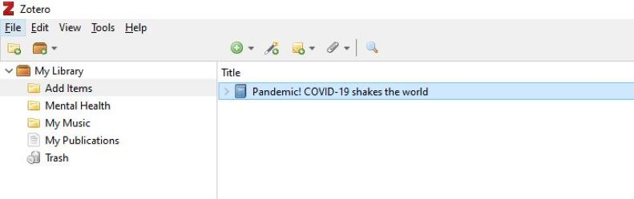

# Citation Management with Zotero
Zotero is a free easy-to-use tool that helps you collect, organize, cite, sync, and share anything you might find on the internet including scholarly publications, news articles, and YouTube videos. It is a great tool to help you do your research. This workshop will guide you through the installation of this tool and the most effective ways to use it. Zotero is available for Windows, Mac, and Linux.

## Turn the cards and swipe right to learn more about the reasons to use Zotero :)

<iframe src="https://h5pstudio.ecampusontario.ca/h5p/42087/embed" width="993" height="651" frameborder="0" allowfullscreen="allowfullscreen"></iframe>

----

## Let's Test your knowledge on Referencing
*Please go through the slideshow below to begin*

<iframe src="https://h5pstudio.ecampusontario.ca/h5p/42080/embed" width="993" height="584" frameborder="0" allowfullscreen="allowfullscreen"></iframe>

----

## Set up Instructions

In preparation for this workshop, you will need to register for a [Zotero account](https://www.zotero.org/user/register). Download the [desktop client](https://www.zotero.org/support/installation) and [browser extension](https://www.zotero.org/download/). Also go though the [install plugins](https://www.zotero.org/support/word_processor_plugin_manual_installation) for your word processors, like LibreOffice or MS Word.

----

## Gathering Data with Zotero
*Please go through the slideshow to lean more on how to gather your items*

<iframe src="https://h5pstudio.ecampusontario.ca/h5p/42095/embed" width="993" height="584" frameborder="0" allowfullscreen="allowfullscreen"></iframe>
----

## Organizing Data with Zotero
*Organizing means arranging data or items into a structured form. You can organize you item with the help of Zotero in the form of collection, library and many more. Please go through the slideshow to lean more*

<iframe src="https://h5pstudio.ecampusontario.ca/h5p/42121/embed" width="993" height="584" frameborder="0" allowfullscreen="allowfullscreen"></iframe>

----

## Sync, Cite and Share with Zotero

<iframe src="https://h5pstudio.ecampusontario.ca/h5p/42152/embed" width="993" height="340" frameborder="0" allowfullscreen="allowfullscreen"></iframe>

## Let's Add the Citation Together. While making a report, I forgot to cite the author’s work. I would like you to help me avoid any charge of plagiarism and do a proper citation. 

### Step 1 – Prepare your document. 

To add citations and a bibliography to my article, please [download](https://github.com/BrockDSL/A-Step-by-Step-Guide-to-Zotero/raw/master/Mental%20Health.docx) the word document. 
Before we move forward, please make sure you have installed the [Zotero word plugin](https://www.zotero.org/support/word_processor_plugin_manual_installation). 

### Step 2- Choosing Citation Style

* Once the word document is open, please click on Zotero Tab, just next to the Help section on top. Once you will click on Zotero, there will be many different options open for you. Please select “Add/Edit Citation” for citation.  

**Learning Fact: Zotero supports 8100 citation style. Try using different citation styles for another document :P**

* The dialogue box will appear to select citation style. Please select APA Citation style for learning purposes.

### Step 3- Red Magic Box

After selecting your citation style, a red color magic box will appear on your word document. Right-click on the Z symbol and select classic view. 

### Step 4- Adding Citation

Once you click on classic view in the previous step, a dialogue box will appear, showing your collection and libraries from Zotero. 
Select folder “Mental Health” in the left corner. Select Title “Mental health” and press “OK”

### Step 5- Citation Inserted. 

You will see your citation is inserted in your Word document. Please see the below image. (I have highlighted and bold the citation for your easy detection) 

*Below is the video demonstrating for your better understanding on how to add citation and bibliography to your document. Please watch and try adding citation and bibliography to your own documents.*

<iframe src="https://h5pstudio.ecampusontario.ca/h5p/42153/embed" width="993" height="593" frameborder="0" allowfullscreen="allowfullscreen"></iframe>
----

## Final Quiz to test your Knowledge!
*Please swipe right to go through the knowledge Test*

<iframe src="https://h5pstudio.ecampusontario.ca/h5p/42123/embed" width="993" height="378" frameborder="0" allowfullscreen="allowfullscreen"></iframe>
----

**This workshop is brought to you by the Brock University Digital Scholarship Lab. For a listing of our upcoming workshops go to Experience BU if you are a Brock affiliate or Eventbrite page for external attendees. For additional inquiries, contact DSL@Brocku.ca or [Zotero Forum](https://forums.zotero.org/discussion/81783/contact)**

----
