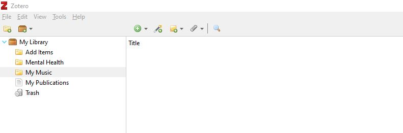
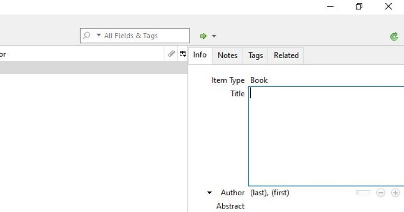

# Citation Management with Zotero
Zotero is a free easy-to-use tool that helps you collect, organize, cite, sync, and share anything you might find on the internet including scholarly publications, news articles, and YouTube videos. It is a great tool to help you do your research. This workshop will guide you through the installation of this tool and the most effective ways to use it. Zotero is available for Windows, Mac, and Linux.

## Turn the cards and swipe right to learn more about the reasons to use Zotero :)

<iframe src="https://h5pstudio.ecampusontario.ca/h5p/42087/embed" width="993" height="651" frameborder="0" allowfullscreen="allowfullscreen"></iframe>

----

## Let's Test your knowledge on Referencing
*Please go through the slideshow below to begin*

<iframe src="https://h5pstudio.ecampusontario.ca/h5p/42080/embed" width="993" height="584" frameborder="0" allowfullscreen="allowfullscreen"></iframe>

----

## Set up Instructions

In preparation for this workshop, you will need to register for a [Zotero account](https://www.zotero.org/user/register). Download the [desktop client](https://www.zotero.org/support/installation) and [browser extension](https://www.zotero.org/download/). Also go though the [install plugins](https://www.zotero.org/support/word_processor_plugin_manual_installation) for your word processors, like LibreOffice or MS Word.

----

## <ins>Gathering Data with Zotero</ins>
*Please go through the slideshow to lean more on how to gather your items*

<iframe src="https://h5pstudio.ecampusontario.ca/h5p/42095/embed" width="993" height="584" frameborder="0" allowfullscreen="allowfullscreen"></iframe>

Let's Add Gather the Data Together.

**Step 1 – Create a collection and Library**

* Click the “New Collection” above the left pane in Zotero to add a new collection. You can also right-click on “My Library” or the name of a Group library and choose “New Collection” to add a new collection.
* A dialogue box will appear where you will have to name your collection. The new collection will appear as a folder under “My Library” or the selected Group library.
 Please create two collections :
1.	Add Items
2.	Mental Health

**Step 2 –  Add Item by Identifier**

* Select the “Add item” folder. Click the “Add Item by Identifier” button at the top of the center column of the Zotero pane.
* A dialogue box will appear to enter the identifier. Type or paste in the identifier - 978-1509546114, and press Enter/Return.
* You will see the title “Pandemic! COVID-19 shakes the world” added to your “Add Items” Collection.

**Step 3 –  Add items manually**

You can add items manually. First, you will have to click on the folder in which you want to add an item. After selecting the folder, you will have to click the green plus sign on the top and select the relevant item type (example: Book). You can add all the metadata under the “Info” Tab. All your work will be saved automatically. 

**Step 4 –  Adding from Browser**

* Go to your browser and open the [link](https://www.medicalnewstoday.com/articles/154543). Please make sure, you have downloaded the browser extension during setup instructions. 
* Once the link is open in your browser, you will see a specific icon near the browser's address bar. Click on the icon and select the folder “Mental Health”. This will automatically save your web page in Zotero. 

**Step 5 –  Add attachment**

* You can also add an attachment to your items. 
* Select folder “Mental Health”, Click on the item you added in the previous step.
* Click on the paper click icon. From the drop-down menu, please select “Attach a link to URI” to add a [link](https://www.mentalhealth.gov/basics/what-is-mental-health) to your item. 
* A dialogue box will appear, where you can add the link and give a title. Select OK to add the attachment to your item. 

----

## <ins>Organizing Data with Zotero</ins>
*Organizing means arranging data or items into a structured form. You can organize you item with the help of Zotero in the form of collection, library and many more. Please go through the slideshow to lean more*

<iframe src="https://h5pstudio.ecampusontario.ca/h5p/42121/embed" width="993" height="584" frameborder="0" allowfullscreen="allowfullscreen"></iframe>

----

## <ins>Sync, Cite and Share with Zotero</ins>

<iframe src="https://h5pstudio.ecampusontario.ca/h5p/42152/embed" width="993" height="340" frameborder="0" allowfullscreen="allowfullscreen"></iframe>

**
Let's Add Citation and Bibliography Together.
**

While making a report, I forgot to cite the author’s work. I would like you to help me avoid any charge of plagiarism and do a proper citation. 

**Step 1 – Prepare your document**

To add citations and a bibliography to my article, please [download](https://github.com/BrockDSL/A-Step-by-Step-Guide-to-Zotero/raw/master/Mental%20Health.docx) the word document. 
Before we move forward, please make sure you have installed the [Zotero word plugin](https://www.zotero.org/support/word_processor_plugin_manual_installation). 

**Step 2- Choosing Citation Style**

* Once the word document is open, please click on Zotero Tab, just next to the Help section on top. Once you will click on Zotero, there will be many different options open for you. Please select “Add/Edit Citation” for citation.  

* The dialogue box will appear to select citation style. Please select APA Citation style for learning purposes.

 <ins>*Learning Fact: Zotero supports 8100 citation style. Try using different citation styles for another document.*</ins>
 
  
**Step 3- Red Magic Box**

After selecting your citation style, a red color magic box will appear on your word document. Right-click on the Z symbol and select classic view. 

**Step 4- Adding Citation**

Once you click on classic view in the previous step, a dialogue box will appear, showing your collection and libraries from Zotero. 
Select folder “Mental Health” in the left corner. Select Title “Mental health” and press “OK”

**Step 5- Citation Inserted**

You will see your citation is inserted in your Word document. Well done on adding your citation.

>  ***Below is the video demonstrating on how to add citation and bibliography to your document. Please watch and try adding citation and bibliography to your own documents, for your better understanding.***

<iframe src="https://h5pstudio.ecampusontario.ca/h5p/42153/embed" width="993" height="614" frameborder="0" allowfullscreen="allowfullscreen"></iframe>

---

## Final Quiz to test your Knowledge!
*Please swipe right to go through the knowledge Test*

<iframe src="https://h5pstudio.ecampusontario.ca/h5p/42123/embed" width="993" height="378" frameborder="0" allowfullscreen="allowfullscreen"></iframe>

---

**This workshop is brought to you by the Brock University Digital Scholarship Lab. For a listing of our upcoming workshops go to Experience BU if you are a Brock affiliate or Eventbrite page for external attendees. For additional inquiries, contact DSL@Brocku.ca or [Zotero Forum](https://forums.zotero.org/discussion/81783/contact)**

---
