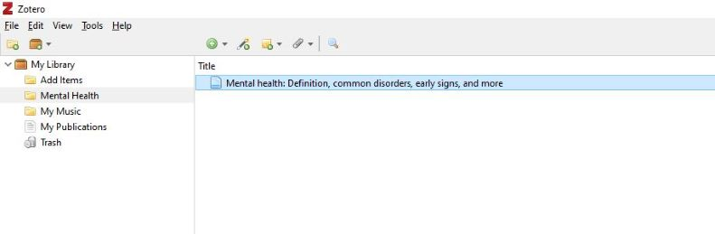

# Set up Instructions

In preparation for this module, you will need to register for a [Zotero account](https://www.zotero.org/user/register). Download the [desktop client](https://www.zotero.org/support/installation) and [browser extension](https://www.zotero.org/download/). Also go though the [install plugins](https://www.zotero.org/support/word_processor_plugin_manual_installation) instructions for your word processors, like LibreOffice or MS Word.

To work through this module, please [download](https://github.com/BrockDSL/A-Step-by-Step-Guide-to-Zotero/raw/master/Mental%20Health.docx) and open the Word document and Zotero software.

----

# Citation Management with Zotero

Zotero is a free easy-to-use tool that helps you collect, organize, cite, sync, and share anything you might find on the internet including scholarly publications, news articles, and YouTube videos. It is a great tool to help you do your research. This module will guide you through the installation of this tool and the most effective ways to use it. Zotero is available for Windows, Mac, and Linux.

<iframe src="https://h5pstudio.ecampusontario.ca/h5p/42087/embed" width="993" height="651" frameborder="0" allowfullscreen="allowfullscreen"></iframe>

----

## Let's Test your knowledge on Referencing

<iframe src="https://h5pstudio.ecampusontario.ca/h5p/42080/embed" width="993" height="584" frameborder="0" allowfullscreen="allowfullscreen"></iframe>

----

# <ins>Gathering Data with Zotero</ins>

<iframe src="https://h5pstudio.ecampusontario.ca/h5p/42095/embed" width="993" height="584" frameborder="0" allowfullscreen="allowfullscreen"></iframe>

**Step 1 – Create a collection and Library**

* Click the “New Collection” button above the left pane in Zotero to add a new collection. You can also right-click on “My Library” or the name of a Group library and choose “New Collection” to add a new collection.
* A dialogue box will appear where you will have to name your collection. The new collection will appear as a folder under “My Library” or the selected Group library.
 Please create two below mentioned collections :
1.	Add Items
2.	Mental Health

**Step 2 –  Add Item by Identifier**

* Select the “Add items” folder. Click the “Add Item by Identifier” button at the top of the center column of the Zotero pane.
* A dialogue box will appear to enter the identifier. Type or paste in the identifier - 978-1509546114, and press Enter/Return.
* You will see the title “Pandemic! COVID-19 shakes the world” added to your “Add Items” Collection.

**Step 3 –  Adding from Browser**

* Go to your browser and open this [link](https://www.medicalnewstoday.com/articles/154543). Please make sure you have downloaded the browser extension during setup instructions. 
* Once the link is open in your browser, you will see a specific icon near the browser's address bar. Click on the icon and select the folder “Mental Health”. This will automatically save your web page in Zotero. 

**Step 4 –  Add attachment**

* You can also add an attachment to your items. 
* Select folder “Mental Health”, Click on the item you added in the previous step.
* Click on the paper clip icon. From the drop-down menu, please select “Attach a link to URI” to add a link to your item. 
* A dialogue box will appear, type or paste in the link : <ins>https://www.mentalhealth.gov/basics/what-is-mental-health</ins> and give a title. 
* Press "OK" to add the attachment to your item. 

----

# <ins>Organizing Data with Zotero</ins>

<iframe src="https://h5pstudio.ecampusontario.ca/h5p/42121/embed" width="993" height="584" frameborder="0" allowfullscreen="allowfullscreen"></iframe>

**Step 1 –  Add Note**

*  To create a Child Note, select the folder “Mental Health”.
* Select an item in the center pane. Then, either click the “New Note” button at the top of the center pane and select “Add Child Note” or go to the “Notes” tab in the right-hand pane and click the “Add” button. 
*  A note editor will appear in the right-hand pane. Type or paste the following in your note editor:
*Mental health disorders can generally be grouped into categories. Some of the most common include:*
1. Anxiety Disorder
2. Eating Disorder
3. Mood Disorder
* Press Enter. Your child note will be automatically created. 

**Step 2 –  Add Tags**

* To add a tag to an item, select the folder “Mental Health”. 
* Select the item in the center Zotero pane, and then click the Tags tab in the right-hand pane. 
* Click the "Add" button, type the tag name – (Example: #Mental Health), and click Enter/Return.

**Step 3 –  Add Related**

* To create a relation, select the folder “Mental Health”. 
* Select an item in the center pane and go to the “Related” tab of the right pane. 
* Click the “Add” button, and click on the “Add items” folder from the same library in the pop-up window (hold down Ctrl or Shift [Windows/Linux] or Cmd or Shift [Mac] to select multiple items) 
* Select the item under the title (Pandemic! COVID-19 shakes the world) and click “OK”. The selected items will now show up as related items in the “Related” tab and clicking an item will take you straight to that item.

----

# <ins>Sync, Cite and Share with Zotero</ins>

*Please click on the headings below to expand the title.*

<iframe src="https://h5pstudio.ecampusontario.ca/h5p/42152/embed" width="993" height="340" frameborder="0" allowfullscreen="allowfullscreen"></iframe>

**Step 1 – Prepare your document**

Please make sure, the word document we downloaded during setup instruction is open for our use.
Before we move forward, please make sure you have installed the [Zotero word plugin](https://www.zotero.org/support/word_processor_plugin_manual_installation). 

**Step 2- Choosing Citation Style**

* In the word document, please click on the Zotero Tab, just next to the "Help" section on the toolbar. Once you will click on Zotero, there will be many different options open for you. Please select “Add/Edit Citation” for citation.

* The dialogue box will appear to select citation style. Please select APA Citation style. 

 <ins>*Learning Fact: Zotero supports 8100 citation style. Try using different citation styles for another document.*</ins>
 
  
**Step 3- Red Magic Box**

After selecting the citation style, a red color magic box will appear on your word document. Right-click on the Z symbol and select classic view. 

**Step 4- Adding Citation**

* Once you click on classic view in the previous step, a dialogue box will appear, displaying your collection and libraries from the Zotero application. 
* Select folder “Mental Health” in the left corner. Select Title “Mental health” and press “OK”.

**Step 5- Citation Inserted**

You will see your citation is inserted in your Word document. Well done on adding your citation.

>  ***Below is the video demonstrating on how to add citation and bibliography to your document. Please watch and try adding citation and bibliography to your own documents, for your better understanding.***

<iframe src="https://h5pstudio.ecampusontario.ca/h5p/42153/embed" width="993" height="614" frameborder="0" allowfullscreen="allowfullscreen"></iframe>

---

# Final Quiz to test your Knowledge!
*Please swipe right to go through the knowledge Test*

<iframe src="https://h5pstudio.ecampusontario.ca/h5p/42123/embed" width="993" height="378" frameborder="0" allowfullscreen="allowfullscreen"></iframe>

---

**This workshop is brought to you by the Brock University Digital Scholarship Lab. For a listing of our upcoming workshops go to Experience BU if you are a Brock affiliate or Eventbrite page for external attendees. For additional inquiries, contact DSL@Brocku.ca or [Zotero Forum](https://forums.zotero.org/discussion/81783/contact)**

---
